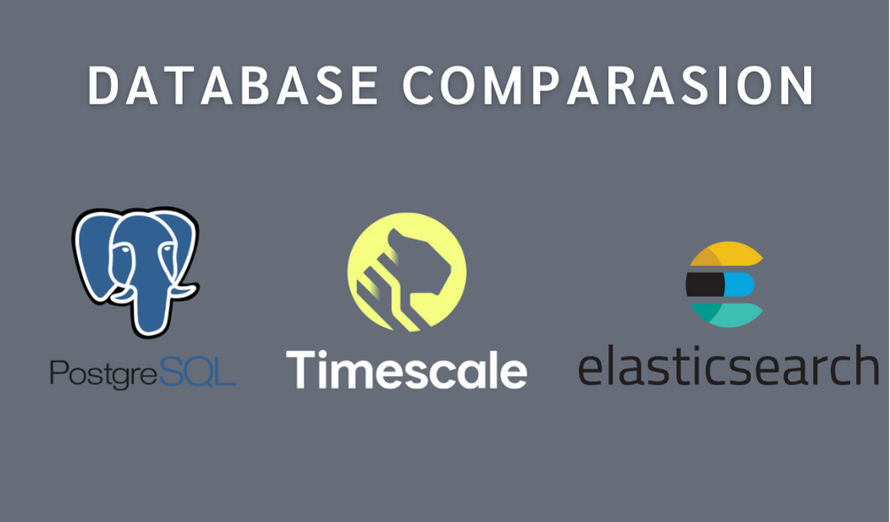

<!-- @format -->

# Vehicle IoT Telemetry Database Comparison



This project demonstrates and compares the performance and capabilities of three different database solutions for handling vehicle IoT telemetry data:

- Native PostgreSQL
- TimescaleDB (PostgreSQL extension for time-series data)
- Elasticsearch

## Project Overview

The project simulates a fleet management system that collects telemetry data from vehicles, including:

- Location (latitude/longitude)
- Speed
- Fuel level
- Engine temperature
- Engine RPM
- Battery voltage
- Engine status
- Odometer readings

### Data Volume

- 10 vehicles
- 1 million records per vehicle (10M total records)
- Data spans 1 year
- Records are generated with 1-second intervals

## Features

### Data Collection

- Real-time vehicle telemetry data collection
- Support for multiple vehicles
- Comprehensive vehicle metrics tracking

### Analytics

1. **Vehicle Hourly Statistics**

   - Average, max, and min speed
   - Average and min fuel level
   - Average and max engine temperature
   - Average engine RPM
   - Average battery voltage
   - Last odometer reading
   - Reading count
   - Most common engine status

2. **Alerts**

   - High engine temperature alerts
   - Low fuel level alerts
   - Configurable thresholds

3. **Vehicle Utilization**
   - Total hours
   - Running hours
   - Idle hours
   - Utilization rate
   - Average moving speed
   - Distance covered

## Database Implementations

### Native PostgreSQL

- Standard PostgreSQL implementation
- Uses materialized views for analytics
- Suitable for basic time-series data

### TimescaleDB

- PostgreSQL extension optimized for time-series data
- Uses continuous aggregates for efficient analytics
- Better performance for time-based queries
- Automatic data retention policies

### Elasticsearch

- Full-text search capabilities
- Efficient aggregations
- Real-time analytics
- Better for complex queries and full-text search

## API Endpoints

### Telemetry Data

```
GET /api/v1/telemetry
Query Parameters:
- vehicleId: string
- start: DateTime
- end: DateTime
- dbType: DatabaseType (Native/Timescale/Elastic)
```

### Analytics

```
GET /api/v1/analytics/stats
Query Parameters:
- vehicleId: string
- start: DateTime
- end: DateTime
- dbType: DatabaseType

GET /api/v1/analytics/alerts
Query Parameters:
- start: DateTime
- end: DateTime
- threshold: double
- alertType: string (temperature/fuel)
- dbType: DatabaseType

GET /api/v1/analytics/utilization
Query Parameters:
- start: DateTime
- end: DateTime
- dbType: DatabaseType
```

## Setup

### Prerequisites

- .NET 9.0
- PostgreSQL 15+
- TimescaleDB extension
- Elasticsearch 8.17.3
- Docker (optional)

### Database Setup

1. PostgreSQL:

   ```sql
   CREATE DATABASE Shared_Native;
   CREATE DATABASE Shared_Timescale;
   ```

2. TimescaleDB:

   ```sql
   CREATE EXTENSION IF NOT EXISTS timescaledb;
   ```

3. Elasticsearch:
   ```bash
   docker run -d --name elasticsearch -p 9200:9200 -e "discovery.type=single-node" -e "xpack.security.enabled=false" docker.elastic.co/elasticsearch/elasticsearch:8.17.3
   ```

### Application Setup

1. Clone the repository
2. Update connection strings in `Program.cs`
3. Run the application:
   ```bash
   dotnet run
   ```

## Performance Comparison

The project allows you to compare the performance of different database solutions for:

- Data ingestion
- Time-series queries
- Aggregations
- Alert generation
- Real-time analytics

## Technologies Used

- .NET 9.0
- Entity Framework Core
- PostgreSQL
- TimescaleDB
- Elasticsearch
- Docker
- Bogus (for data generation)
